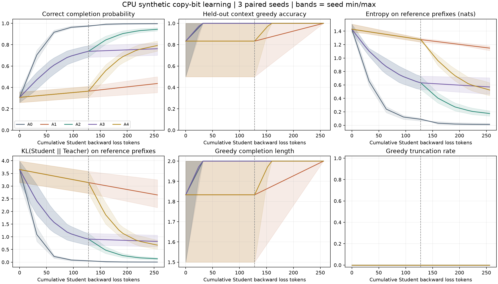
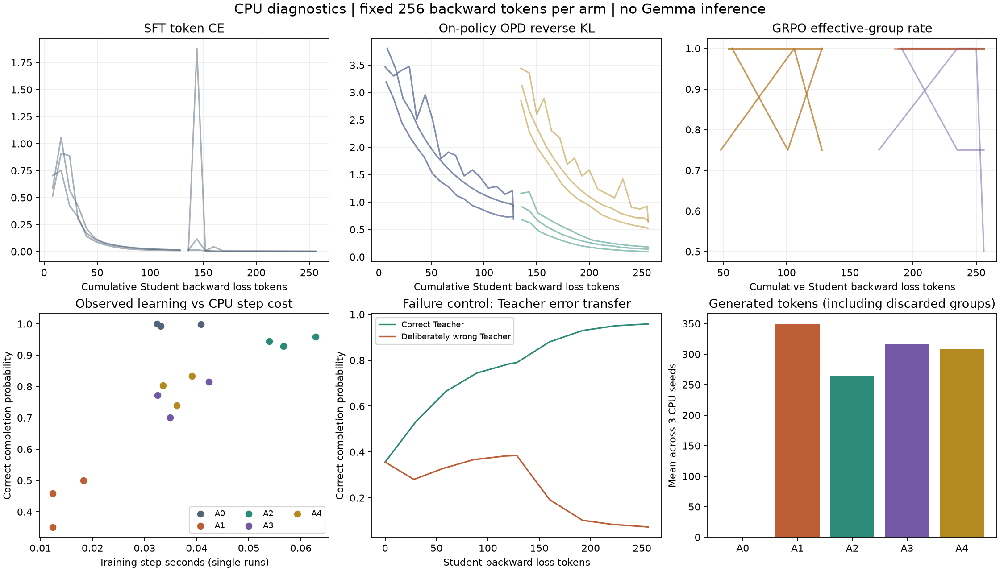

# D12：五臂两阶段 CPU 学习实验

2026-09-09 完成。使用 D09 模型、D10 的实际训练循环和 D11 last-position rollout head，完成 **5 臂 × 2 阶段 × 3 个 CPU paired seeds**。30 个阶段均精确完成 128 个 Student backward loss tokens；主合成矩阵合计 3,840 tokens。不是 Gemma 训练或正式 C1/C2 实验。

```bash
uv sync --frozen --all-groups
uv run --frozen python scripts/train_cpu_example.py --dry-run
uv run --frozen python scripts/train_cpu_example.py
# 已有结果只重新绘图
uv run --frozen python scripts/train_cpu_example.py --plot-only
```

实现：`src/posttrain_lab/experiments/cpu_learning.py`。完整输入规则、配置、逐 step 指标、逐 checkpoint 评测和成本见 [D12 JSON](../../artifacts/cpu/d12_learning.json)；导出图同时提供 PNG/PDF。绘图使用锁定在 dev dependency group 的 Matplotlib。

## 技术问题与控制变量

目标是检查三个 objective 能否沿同一框架学习，阶段 reset 和精确 token 预算是否生效，以及 loss/accuracy/entropy/成本是否讲述一致的行为。

任务为合成 copy-bit：prompt `[BOS, context, bit]`，正确 completion 为 `[bit, EOS]`。bit ID 为 3/4，训练 context 为 5/6，评测 context 为 7/8；各有四个组合，prompt 集合隔离。reward 是整个 completion token 序列的 exact equality，多余 token、错误 bit 或提前 EOS 均为 0。没有真实训练数据、文本 tokenizer 或公开 benchmark。

- CPU FP32、单线程；三个开发 seeds 为 **11、22、33**，不同于正式研究 seeds。
- Student 为本地初始化的 vocab 9、hidden 24、MLP 48、1 layer/4 heads 文本模型；Teacher hidden 32、MLP 64。此示例训练全部文本参数，LoRA 的更新路径另由 D09/D10 验证。
- 每 seed 先以 64 个 loss tokens 训练 Student SFT anchor，以同一合成训练集的 512 个 loss tokens 训练 Teacher，然后冻结 Teacher；五臂分别 deepcopy 同一个 anchor。
- 同 objective 跨 arm/stage 使用同一配置：SFT LR 0.02，GRPO/OPD LR 0.005；AdamW、weight decay 0、grad clip 1；阶段 LR 随成功消耗 token 线性衰减至 10%。每阶段重置 optimizer/scheduler。
- max new tokens 2、group size 8、temperature 1、全词表随机采样。每阶段 128 loss tokens、每臂 256；每阶段 sampling seed 为 `paired_seed + stage × 1000`。
- 所有曲线来自实际测量。常规评测每 4 次成功更新及阶段末执行，图中用线性插值对齐 token 网格；阴影为三个 seed 的 min/max，**不是置信区间**。

这些参数只使合成框架示例可复跑；不用于选择正式 Gemma recipe，也不能把不同 learning rate、group 和 update 数的影响解释成一般算法优劣。

## 学习结果



主表中正确完整输出概率为两个正确 token 条件概率的乘积，再对四个评测 prompt 求均值；不同于 greedy accuracy，也不是采样 pass@k 的估计。

| Arm | 阶段顺序 | 最终正确完整输出概率：均值 [seed min, max] | 最终 greedy accuracy | 平均成功更新次数 | 平均生成 tokens |
|---|---|---|---:|---:|---:|
| A0 | SFT → SFT | 0.9970 [0.9924, 0.9996] | 100% | 32.0 | 0 |
| A1 | GRPO → GRPO | 0.4367 [0.3511, 0.5000] | 100% | 6.0 | 348.7 |
| A2 | OPD → OPD | 0.9440 [0.9288, 0.9583] | 100% | 34.0 | 264.0 |
| A3 | OPD → GRPO | 0.7623 [0.7006, 0.8142] | 100% | 20.3 | 317.0 |
| A4 | GRPO → OPD | 0.7923 [0.7394, 0.8337] | 100% | 20.3 | 308.3 |

所有臂均从相同 seed 的同一 anchor 出发，anchor 正确完整输出概率分别为 0.3559、0.2584、0.3076；Teacher 的该概率约为 0.9997–0.9998，评测 greedy accuracy 均为 100%。

这个任务很简单，最终 accuracy 已饱和，但完整输出概率、entropy 与 Teacher KL 仍能区分学习程度。GRPO 在每个 logical batch 中使用更多 completion，因此相同 token 预算对应较少 optimizer 更新；预算匹配不等于 update 次数匹配，不能把表中差异简化成“GRPO 不如 SFT”或推广某个顺序。

生成 token 数包含零方差组和末批预算丢弃的部分，所以 GRPO 的生成成本超过实际计入的 256 backward tokens。SFT 的 0 仅表示没有 rollout，不表示没有模型 forward/backward 成本。当前正常矩阵出现部分 group 无效，未出现整批被跳过；全零/全一 reward 导致的有界停机由 D10 集成测试验证。

## 动态、成本与失败案例



训练日志同时保留 CE、on-policy KL、GRPO loss/reward/entropy/clip/有效组率、长度/截断和五段时间。图中的 reference-prefix KL 用固定正确 completion prefix 评测，训练 OPD KL 则用当前 Student 采样 prefix，两者不能混为同一统计量。当前每批只更新一次，GRPO importance ratio 约 1、clip fraction 0 是预期状态。

学习图的 cost 点来自每条短 run 的实际 step 时间，包含 rollout/Teacher/update，排除 anchor 构建、独立评测、JSON 与绘图；它们只帮助解释此示例的计算开销，不是稳定性能对照。正式 CPU 性能测量与波动见 [D11 报告](../performance/CPU_BENCHMARK.md)。

额外构造一个明确标注的错误 Teacher：使用相同训练集但故意反转 bit 标签训练 Teacher，在正确任务上 greedy accuracy 为 0%。从 seed 11 的相同 Student anchor 出发，使用与 A2 相同的两阶段 OPD recipe 和 256 tokens：

| 指标 | 更新前 | 错误 Teacher OPD 后 |
|---|---:|---:|
| 正确完整输出概率 | 0.3559 | 0.0725 |
| greedy accuracy | 100% | 0% |
| 正确 reference token NLL | 0.5168 | 1.3165 |
| reference-prefix KL(Student \|\| 错误 Teacher) | 5.2227 | 0.5173 |

Student 更接近 Teacher，正确性却下降；这验证了 loss 下降不保证任务能力提升，并直接展示 Teacher 错误迁移。此 Teacher 是人为构造的压力对照，不属于主五臂，也不是对自然 Teacher 错误率的估计。

## 完成边界与下一步

D12 已完成实际五臂两阶段更新、学习/行为/成本曲线以及退化案例；Teacher 在主矩阵过程中保持参数不变且无梯度。独立 evaluator 单元测试另外核对完整输出概率的乘积语义，并确认评测不改变 Student 参数、训练模式或 CPU RNG。

目前核心进度 **12/24**，CPU D01–D12 均完成。下一模块 **D13：accelerator 与分布式训练运行时**，需先满足 G0：取得 GPU 执行授权、连接方式、GPU 型号/数量/显存、可用时间与资源预算。之后才接入 BF16、实际所需的分布式/累积运行时、显存/通信测量与必要的 save/resume。真实模型和数据下载、Gemma 接入属于后续已授权范围才能执行的工作；当前没有执行这些动作。
