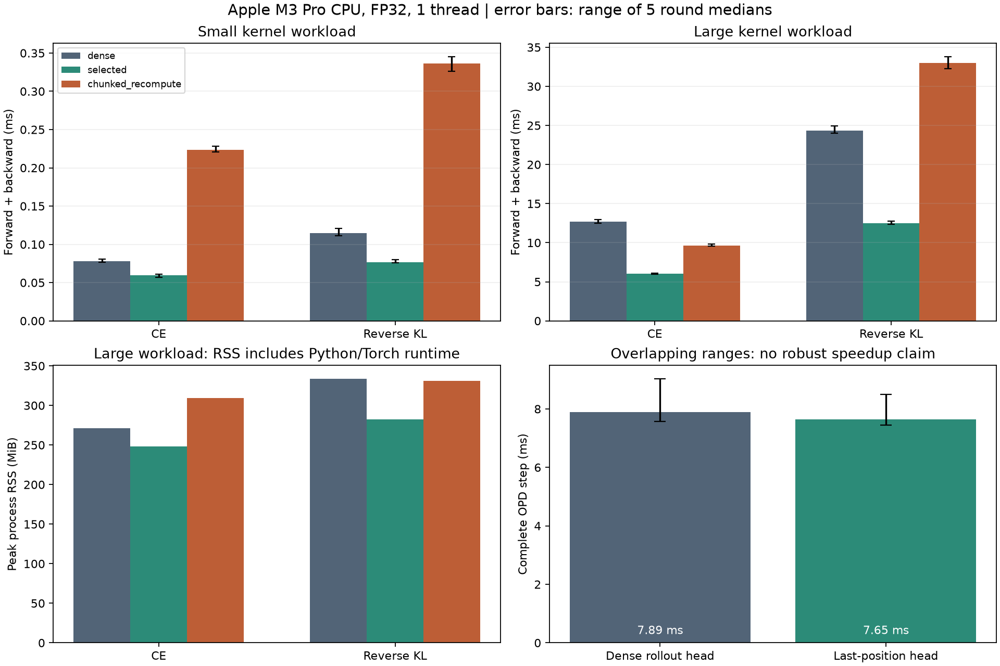

# D11：CPU loss 与完整 step 性能实测

2026-09-09 完成。代码在 `src/posttrain_lab/performance/cpu.py`；[完整记录](../../artifacts/cpu/d11_performance.json) 保存配置、逐轮计时、CPU profiler 形状与 RSS。运行：

```bash
uv run --frozen python scripts/profile_cpu.py --dry-run
uv run --frozen python scripts/profile_cpu.py
# 只重新绘图，不重新测量
uv run --frozen python scripts/profile_cpu.py --plot-only
```



## Workload 与测量边界

- Apple M3 Pro，Darwin arm64，CPU 单线程，Python 3.12.13 / PyTorch 2.14.0，FP32；无 accelerator。
- 每种实现独立子进程，依次执行，避免不同测量相互争抢 CPU。每个 timing phase 10 次 warm-up、5 轮 × 30 次测量。
- small：`B=2,T=16,V=256,H=32,H_teacher=48`，16 个有效 target；large：`B=4,T=64,V=16384,H=64,H_teacher=96`，128 个有效 target。固定 seed 29，只选择后半序列。
- dense 在完整预测位置上投影并构建 loss；selected 先选有效 hidden positions，一次投影所有有效位置；chunked_recompute 使用 D02/D04、chunk size 32、原有 checkpoint 重计算。
- kernel 时间包括清空梯度、forward、以及指定的 backward；没有模型 decoder、采样或 optimizer。forward 和 forward+backward 分开记录。表中为 forward+backward。
- RSS 为独立进程在整个 workload 内的峰值，包含解释器、PyTorch、输入/参数和运行时，不能当成 activation 字节。数值/梯度 oracle 在另一进程执行，避免 dense reference 的峰值污染分块实现的 RSS。每种实现报告一次进程峰值，不提供内存置信区间。
- 四个独立 oracle 均在预设 FP32 `rtol=1e-4, atol=2e-6` 下通过 loss 和 hidden/head gradient 对照。

## 核函数结果

下列为实测中位数；逐轮中位数范围、p95、forward 时间及有效 kernel tokens/s 保存在 JSON。图中误差线是 5 个轮中位数的范围。

| workload / objective | dense ms | selected ms | chunk/recompute ms | dense / selected / chunk 峰值 RSS MiB |
|---|---:|---:|---:|---|
| small CE | 0.078 | 0.059 | 0.224 | 215.8 / 202.1 / 275.2 |
| small KL | 0.115 | 0.077 | 0.337 | 203.0 / 202.5 / 279.4 |
| large CE | 12.666 | 6.015 | 9.640 | 271.4 / 248.5 / 309.1 |
| large KL | 24.338 | 12.490 | 32.977 | 334.0 / 282.2 / 330.7 |

在这些可容纳形状中，先选择有效位置的实现耗时最低。checkpoint 重计算在小形状上有明显额外开销；large KL 的 chunk/recompute 也比 dense 更慢。分块约束了每次投影形状，但当前进程 RSS 数据不支持“分块必然降低整体内存”的说法。RSS 同时包含运行时和 allocator 行为，不能单独把差值归因于某个中间张量。

这是一组有用的负结果：在较小 CPU workload 上，增加重计算可能既慢又没有整体 RSS 收益；不能把分块的理论张量上限直接写成实测内存下降。D02/D04 的 exact/recompute 路径保留用于大词表受限场景，后续在真实硬件重新确定取舍。

## Profile 指向的优化：rollout 只投影最后位置

完整 OPD workload 使用 `B=4`、24-token prompt、最多生成 4 tokens、vocab 4096、hidden 48、2 层 Student/Teacher。每次更新使用同一 D10 loop，包含采样、Teacher、loss、backward、AdamW 与预算提交，所有模型、seed、生成策略、LR 与精度固定。

baseline profile 显示采样是最大的 step 分段。LM-head profiler 形状为 `[96/100/104/108,48] × [48,4096]`：每个生成时刻重新投影整个 prefix，但只使用最后位置。D11 改为先取得各行最后有效 hidden state，再调用线性 head，形状变为每次 `[4,48] × [48,4096]`。它减少了无用投影，保留完整 decoder 前向，没有实现 KV cache，也没有近似词表或改变采样分布。

| 完整 OPD step 指标 | dense rollout head | last-position head |
|---|---:|---:|
| total median ms | 7.888 | 7.647 |
| total p95 ms | 10.512 | 10.690 |
| 5 轮中位数范围 ms | 7.570–9.039 | 7.445–8.489 |
| sample median ms | 3.394 | 3.141 |
| end-to-end effective loss tokens/s | 1880.8 | 1994.1 |
| 进程峰值 RSS MiB | 289.8 | 286.4 |

当前 median 差约 3.1%，轮间范围明显重叠且 p95 未改善，**不能据此宣称稳定端到端加速**。省掉的投影有 profiler 形状和采样等价测试支持，但 decoder 重算、采样以及 backward 仍占成本。表中的吞吐按全部计时记录的实际 loss tokens/总时间计算，故不等于用 median 倒数推导的吞吐。

profile 本身有额外开销；JSON 中的 `profiled_step_timings_ms` 只定位算子，不混入上述 150 次未开启 profiler 的性能统计。D12 的短学习 run 计时另列，也不与本表合并。

## 结论范围

D11 已完成 baseline→profile→优化尝试→复测→解释。主要交付是有效位置选择、重计算和 rollout head 的真实取舍，而非预设加速倍数。所有数值只属于本机 CPU 合成形状，不能推断 Gemma/GPU 的速度、显存或准确率；D18–D20 再用真实 workload 校准。
